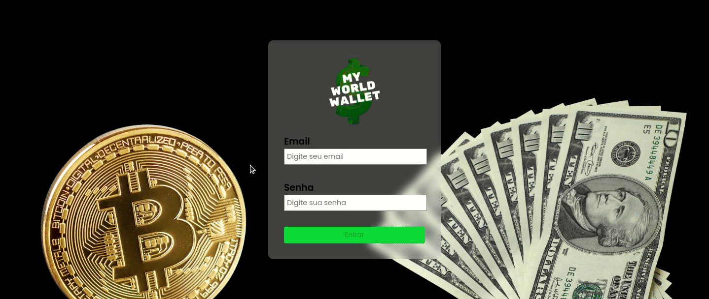
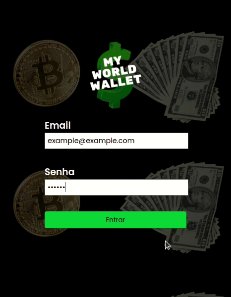

  

<h1 align="center">My World Wallet</h1>

Application that works as a wallet, where you can specify your expenses and convert in selected currency.

## Demo

Try this project: https://my-world-wallet.vercel.app/ 

Desktop demo:

    

Mobile demo: 

  

 

## Used Technologies

* REACT.JS
* REDUX
* CSS

## Components

* ECONOMIA AWESOME API

## Features

* Has a login page to put email and password
* Can save the expenses by selected options
* Can convert expenses in selected currency
* Calculates total expenses
* Works as a converter for just for queries too

## To Run Locally

Clone the project

`git clone https://github.com/andrearnoni/my-world-wallet.git`

Go to the project directory

`cd my-world-wallet`

Install dependencies

`npm install`

Start the server

`npm start`

## Author

This project was coded and designed by [@andrearnoni](https://github.com/andrearnoni).

### Go to my [Portfolio!](https://andrearnoni.vercel.app/) 
### Connect with me at [LinkedIn!](https://www.linkedin.com/in/andrearnoni/)